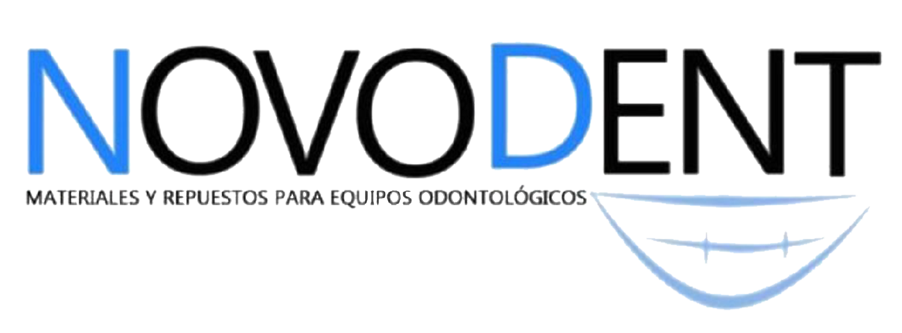

# 🦷 Novodent - Sitio Web Corporativo

<div align="center">
  
  
  ### Distribuidor Oficial de Equipos Odontológicos en Venezuela
  
  [](https://github.com/Fabioo99/novodent-web)
  [](LICENSE)
  [](https://reactjs.org/)
  [](https://www.typescriptlang.org/)
</div>

---

## 📋 Descripción del Proyecto

Sitio web corporativo moderno y profesional para **Novodent C.A.**, empresa con más de 45 años de experiencia en la distribución de equipos y suministros odontológicos en Venezuela. 

El sitio presenta:
- ✨ Catálogo interactivo de más de 20 marcas internacionales
- 📱 Diseño responsive y optimizado para móviles
- 🎨 Interfaz moderna con animaciones suaves
- 📞 Integración directa con WhatsApp para contacto
- 🔍 Páginas individuales para cada marca con productos destacados
- 🗺️ Mapa de ubicación integrado
- 📧 Formulario de contacto funcional

---

## 🚀 Tecnologías Utilizadas

Este proyecto está construido con tecnologías modernas y de alto rendimiento:

| Tecnología | Versión | Propósito |
|------------|---------|-----------|
| **React** | 18.3.1 | Framework principal |
| **TypeScript** | 5.5.3 | Tipado estático |
| **Vite** | 5.4.1 | Build tool y dev server |
| **Tailwind CSS** | 3.4.11 | Estilos y diseño |
| **shadcn/ui** | Latest | Componentes UI |
| **React Router** | 6.26.2 | Navegación |
| **Lucide React** | 0.462.0 | Iconografía |

---

## 📦 Instalación y Configuración

### Requisitos Previos

- **Node.js** versión 18.x o superior ([Descargar aquí](https://nodejs.org/))
- **npm** o **yarn** como gestor de paquetes
- **Git** para control de versiones

### Pasos de Instalación

1. **Clonar el repositorio**
```bash
git clone https://github.com/Fabioo99/novodent-web.git
cd novodent-web
```

2. **Instalar dependencias**
```bash
npm install
```

3. **Configurar variables de entorno (opcional)**
```bash
cp .env.example .env
# Editar .env con tus configuraciones
```

4. **Iniciar servidor de desarrollo**
```bash
npm run dev
```

El sitio estará disponible en `http://localhost:8080`

---

## 🛠️ Scripts Disponibles

| Comando | Descripción |
|---------|-------------|
| `npm run dev` | Inicia el servidor de desarrollo |
| `npm run build` | Genera build de producción |
| `npm run preview` | Previsualiza el build de producción |
| `npm run lint` | Ejecuta el linter de código |

---

## 📁 Estructura del Proyecto

```
novodent-dental-showcase/
├── public/                 # Archivos estáticos
│   ├── logo-novodent.png
│   ├── brands/            # Imágenes de marcas y productos
│   └── ...
├── src/
│   ├── components/        # Componentes React
│   │   ├── Header.tsx     # Navegación principal
│   │   ├── Footer.tsx     # Pie de página
│   │   ├── Hero.tsx       # Sección hero
│   │   ├── Brands.tsx     # Carrusel de marcas
│   │   ├── Contact.tsx    # Formulario de contacto
│   │   └── ui/            # Componentes UI reutilizables
│   ├── pages/             # Páginas de la aplicación
│   │   ├── Index.tsx      # Página principal
│   │   ├── BrandPage.tsx  # Página de marca individual
│   │   └── NotFound.tsx   # Página 404
│   ├── assets/            # Recursos multimedia
│   ├── lib/               # Utilidades y helpers
│   ├── App.tsx            # Componente raíz
│   └── main.tsx           # Punto de entrada
├── .gitignore
├── package.json
├── tsconfig.json
├── vite.config.ts
├── tailwind.config.ts
├── README.md
├── DEPLOYMENT.md          # Guía de despliegue
├── MAINTENANCE.md         # Guía de mantenimiento
└── LICENSE

```

---

## 🎨 Características Principales

### 1. **Página Principal**
- Hero section con llamado a la acción
- Carrusel de marcas representadas
- Sección "¿Por qué elegir Novodent?"
- Testimonios de clientes
- Formulario de contacto
- Mapa de ubicación

### 2. **Páginas de Marcas**
- Información detallada de cada marca
- Galería de productos destacados
- Botones de contacto directo
- Navegación intuitiva

### 3. **Integración WhatsApp**
- Contacto directo desde cualquier página
- Formulario que pre-carga mensaje en WhatsApp
- Botones de acción rápida

### 4. **Diseño Responsive**
- Optimizado para móviles, tablets y desktop
- Menú hamburguesa en dispositivos móviles
- Imágenes optimizadas

---

## 🌐 Despliegue

Para instrucciones detalladas de despliegue, consulta [DEPLOYMENT.md](DEPLOYMENT.md)

### Despliegue Rápido en Vercel

```bash
npm run build
# Subir carpeta dist/ a Vercel
```

El sitio actualmente está desplegado en: **[URL del sitio]**

---

## 🔧 Mantenimiento

Para guías de mantenimiento y actualización del contenido, consulta [MAINTENANCE.md](MAINTENANCE.md)

### Tareas Comunes:

- **Agregar nueva marca**: Editar `src/pages/BrandPage.tsx`
- **Actualizar información de contacto**: Editar componentes `Header.tsx`, `Footer.tsx`, `Contact.tsx`
- **Cambiar imágenes**: Reemplazar archivos en `public/`

---

## 📞 Información de Contacto

**Novodent C.A.**
- 📱 WhatsApp: +58 412 4555310
- 📧 Email: novodent.vzla@gmail.com
- 📍 Ubicación: Valencia, Estado Carabobo, Venezuela
- 📷 Instagram: [@novodentca](https://instagram.com/novodentca)

**Horario de Atención:**
- Lunes a Viernes: 8:00 AM - 5:00 PM
- Sábado y Domingo: Cerrado

---

## 📄 Licencia

Este proyecto está bajo la Licencia MIT. Ver el archivo [LICENSE](LICENSE) para más detalles.

---

## 🤝 Soporte

Para soporte técnico o consultas sobre el sitio web:
1. Revisar la documentación en [MAINTENANCE.md](MAINTENANCE.md)
2. Contactar al equipo de desarrollo
3. Abrir un issue en el repositorio (si aplica)

---

## 📝 Notas de Versión

### Versión 1.0.0 (2025)
- ✅ Lanzamiento inicial del sitio web
- ✅ Integración de 20+ marcas internacionales
- ✅ Sistema de navegación completo
- ✅ Formulario de contacto funcional
- ✅ Integración con WhatsApp
- ✅ Diseño responsive
- ✅ Optimización SEO básica

---

<div align="center">
  <p>Desarrollado con ❤️ para Novodent C.A.</p>
  <p>© 2025 Novodent. Todos los derechos reservados.</p>
</div>
